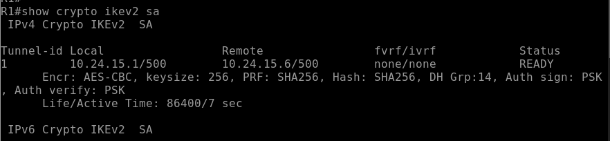
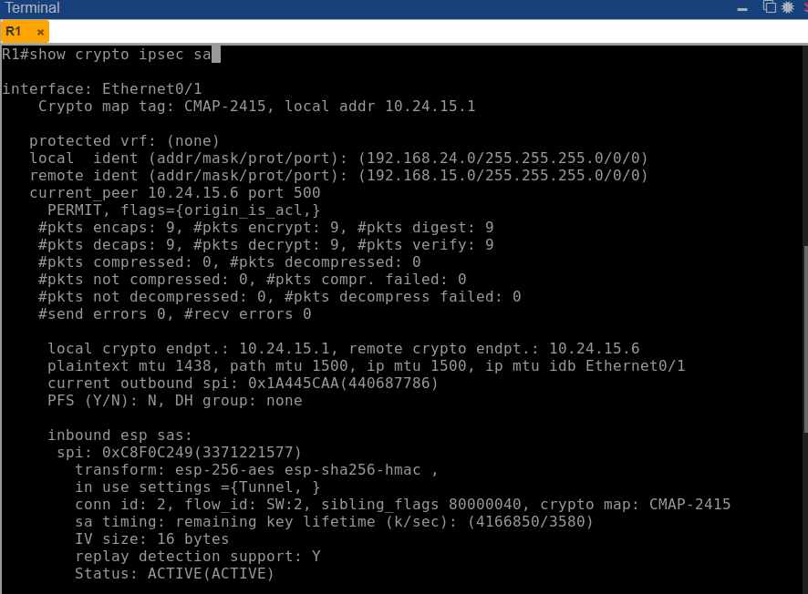
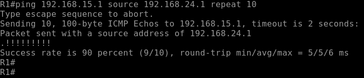

# VPN Site-to-Site IPSec IKEv2 Policy-Based

**Estudiante:** Edwin De Paula  
**Matricula:** 2024-2415  
**Institución:** Instituto Tecnológico de las Américas (ITLA)  
**Asignatura:** Seguridad en Redes

---

## Video

| Recurso | URL |
|---|---|
| Video YouTube | https://youtu.be/AGQaYqu3mtM |

---

## Objetivo

Implementar una VPN Site-to-Site basada en políticas utilizando IPSec con IKEv2 entre dos sitios remotos a través de un router ISP. IKEv2 reemplaza el protocolo ISAKMP de IKEv1 con un intercambio de mensajes más eficiente y seguro, usando objetos separados de proposal, policy, keyring y profile para una configuración más modular y robusta.

---

## Topología


| Dispositivo | Interfaz | Dirección IP | Descripción |
|---|---|---|---|
| R1 | Ethernet0/0 | 192.168.24.1/24 | LAN Site A |
| R1 | Ethernet0/1 | 10.24.15.1/30 | WAN hacia ISP |
| ISP | Ethernet0/0 | 10.24.15.2/30 | WAN hacia R1 |
| ISP | Ethernet0/1 | 10.24.15.5/30 | WAN hacia R2 |
| R2 | Ethernet0/0 | 10.24.15.6/30 | WAN hacia ISP |
| R2 | Ethernet0/1 | 192.168.15.1/24 | LAN Site B |
| PC-A | eth0 | 192.168.24.10/24 | Gateway: 192.168.24.1 |
| PC-B | eth0 | 192.168.15.10/24 | Gateway: 192.168.15.1 |

---

## Parámetros de Configuración

### IKEv2 Proposal

| Parámetro | Valor |
|---|---|
| Nombre | PROP-2415 |
| Cifrado | AES-CBC-256 |
| Integridad | SHA-256 |
| Grupo Diffie-Hellman | Grupo 14 (2048 bits) |

### IKEv2 Policy

| Parámetro | Valor |
|---|---|
| Nombre | POL-2415 |
| Proposal asociado | PROP-2415 |

### IKEv2 Keyring

| Parámetro | Valor |
|---|---|
| Nombre | KR-2415 |
| Peer R1 | 10.24.15.1 |
| Peer R2 | 10.24.15.6 |
| Pre-shared Key | Edwin2024 |

### IKEv2 Profile

| Parámetro | Valor |
|---|---|
| Nombre | IKEV2-PROF-2415 |
| Match identity R1 | 10.24.15.6/255.255.255.255 |
| Match identity R2 | 10.24.15.1/255.255.255.255 |
| Autenticación local | Pre-shared Key |
| Autenticación remota | Pre-shared Key |

### Fase 2 - IPSec (Transform Set)

| Parámetro | Valor |
|---|---|
| Nombre | TS-2415 |
| Protocolo | ESP |
| Cifrado | AES 256 |
| Integridad | SHA-256 HMAC |
| Modo | Tunnel |

### Crypto Map

| Parámetro | Valor |
|---|---|
| Nombre | CMAP-2415 |
| Secuencia | 10 |
| Peer R1 | 10.24.15.1 |
| Peer R2 | 10.24.15.6 |
| IKEv2 Profile | IKEV2-PROF-2415 |
| ACL interesante | ACL-VPN-2415 |

---

## Explicación de la Configuración

### ¿Qué es IKEv2?

IKEv2 es la versión mejorada del protocolo de intercambio de claves IKE. A diferencia de IKEv1 que usa dos fases separadas con múltiples mensajes, IKEv2 completa la negociación en un único intercambio de 4 mensajes (2 request/response), lo que lo hace más rápido y eficiente. Además, IKEv2 tiene soporte nativo para movilidad, NAT traversal y autenticación EAP.

### Diferencia de configuración entre IKEv1 e IKEv2

| Componente | IKEv1 | IKEv2 |
|---|---|---|
| Parámetros de cifrado | `crypto isakmp policy` | `crypto ikev2 proposal` |
| Política global | Incluida en policy | `crypto ikev2 policy` |
| Credenciales | `crypto isakmp key` | `crypto ikev2 keyring` |
| Perfil de conexión | No existe | `crypto ikev2 profile` |
| Aplicación en crypto map | Implícita | `set ikev2-profile` |

### Flujo de Negociación IKEv2

1. PC-A genera tráfico hacia 192.168.15.0/24
2. R1 evalúa el paquete contra ACL-VPN-2415 — coincide
3. R1 inicia negociación IKEv2 con R2 — intercambio de 4 mensajes
4. Se establece la SA IKEv2 (equivalente a Fase 1 en IKEv1)
5. Se negocia la IPSec SA usando el transform set TS-2415
6. El tráfico fluye cifrado entre ambos sitios

---

## Verificación

### IKEv2 SA

```
show crypto ikev2 sa
```



El estado `READY` confirma que la SA IKEv2 está establecida. Se muestran los parámetros negociados: AES-CBC-256, SHA256, grupo DH 14 y autenticación PSK en ambas direcciones.

### IPSec SA - Fase 2

```
show crypto ipsec sa
```



Los contadores de paquetes cifrados y descifrados confirman que el tráfico está siendo procesado correctamente. Transform set `esp-256-aes esp-sha256-hmac` en modo Tunnel con status `ACTIVE(ACTIVE)`.

### Prueba de Conectividad

```
ping 192.168.15.1 source 192.168.24.1 repeat 10
```



El primer paquete se pierde durante la negociación inicial de la SA — comportamiento normal en VPNs policy-based. Los paquetes subsecuentes llegan correctamente confirmando el funcionamiento end-to-end de la VPN.

---

## Archivos del Repositorio

```
ipsec-ikev2-policy-based/
├── configs/
│   ├── R1.txt
│   ├── ISP.txt
│   └── R2.txt
├── docs/
│   └── screenshots/
│       ├── topology.png
│       ├── ikev2-sa.png
│       ├── ipsec-sa.png
│       └── ping-test.png
└── README.md
```

---

## Herramientas Utilizadas

- PNetLab — Plataforma de emulación de red
- Cisco IOSv 15.4(2)T4 — Imagen de router emulado
- VMware — Virtualización del servidor PNetLab
